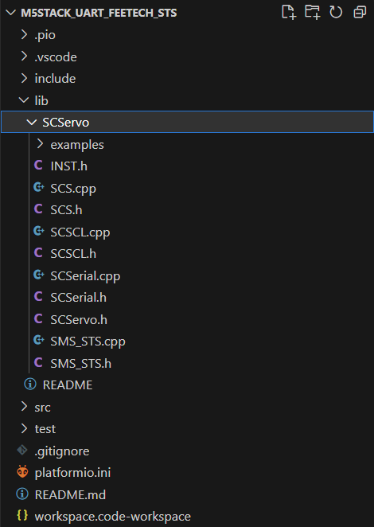

## Installation

1. Download scs library from akizukidenshi

    link: https://akizukidenshi.com/download/ds/feetech/SCServo.zip

1. Extract library
    extract `SCServo.zip`.

1. Place library
    Place the `SCServo` as shown in the image below.
    Default is `M5Stack_uart_feetech_sts/lib/SCServo`
    

## Change RX/TX Pin (Optional)

By default, PortA pins (32, 33) of Core2 are set. Please change as necessary.

## Build & Upload

Just do the standard build and upload on platformIO!